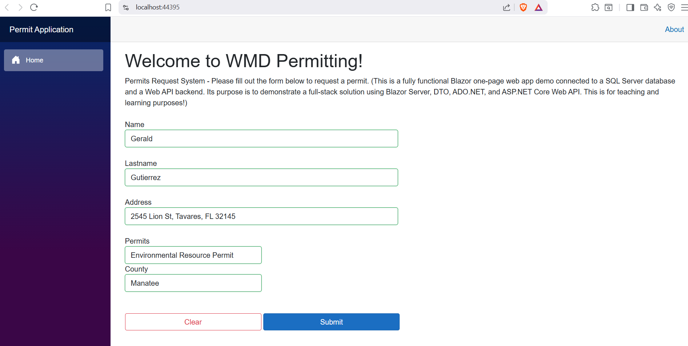
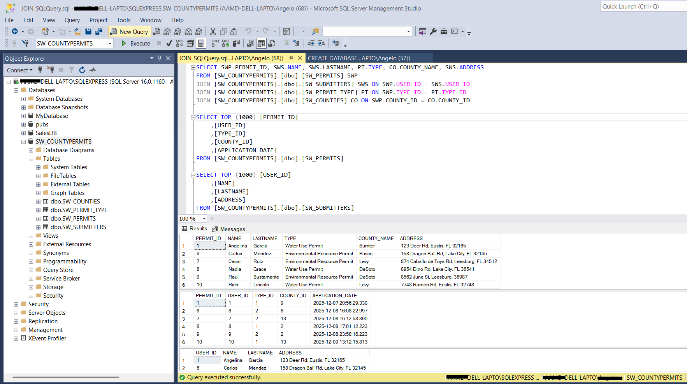

# PermitWebApp
A Blazer web app example using web forms and REST API.
This is a fully functional Blazor one-page web app demo connected to a SQL Server database and a Web API backend.
Its purpose is to demonstrate a full-stack solution using Blazor Server, DTO, ADO.NET, and ASP.NET Core Web API.
This is for teaching and learning purposes!

Replace the `"DefaultConnection"` in the `appSettings.json` file and the port number for the URL in the line `var appBaseUri = new Uri("https://localhost:44395/");` in the file `Program.cs`.

# UI and SQL DB results example

## UI showing all fields required to submit the form values to a database table (SQL Server)

## Example of results after doing a SQL request using JOIN
